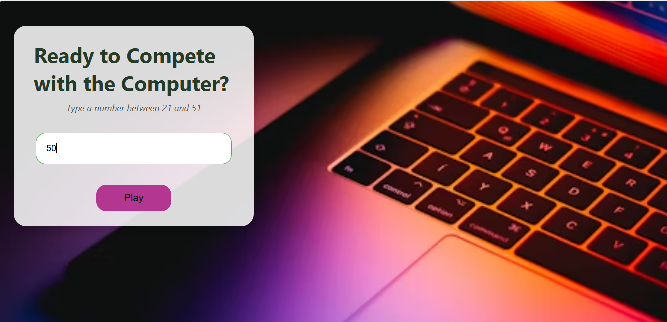

# 🎮 Compete with the Computer

A simple interactive number guessing game where the user competes against the computer. 

Enter a number between **21 and 51** and try to guess the number the computer picked randomly!

---

## 📸 DEMO



---

Please open the app here: https://my-computer-game.netlify.app/

## 💡 How to Play

1. The computer picks a random number between **1 and 51**.
2. You enter a number between **21 and 51** in the input field.
3. Press **Enter** or click **Play**.
4. The game will give you hints whether to guess higher or lower — or congratulate you if you get it right!

---

## 🛠️ Technologies Used

- HTML
- CSS
- JavaScript
- [SweetAlert2](https://sweetalert2.github.io/) for custom alerts

---


## 🚀 Getting Started

To run the game locally:

1. Clone this repository:
   ```bash
   git clone https://github.com/YOUR_USERNAME/YOUR_REPOSITORY.git
Open the index.html file in your browser.

📌 License This project is open-source and available under the MIT License.

This project was created as part of a learning exercise and is intended for educational use only.

Feel free to ask questions or suggest improvements!

